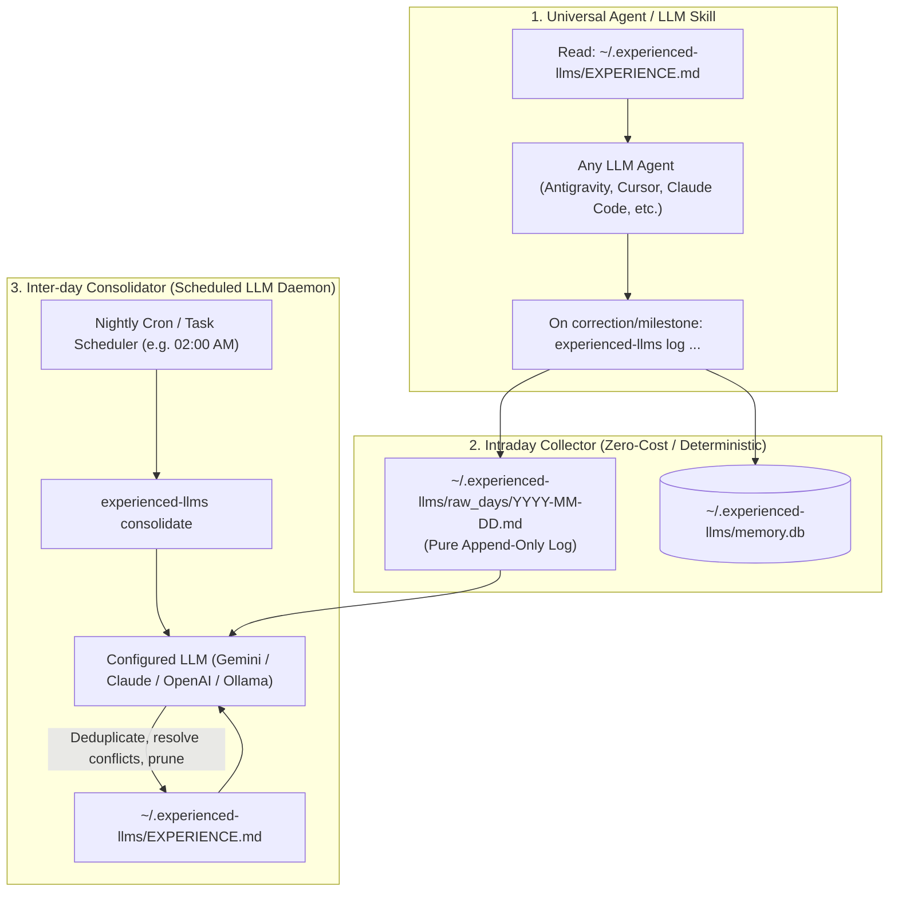

# Experienced LLMs

> **Universal Self-Learning Memory & Autonomous Consolidation Engine for Any AI Setup**

Experienced LLMs is a standalone, AI-agnostic memory engine that learns from your daily coding interactions. It automatically accumulates user preferences, architectural decisions, and bug corrections—eliminating the need to manually author skills or prompt rules.

It works with **any AI environment**: pure cloud models (Gemini, Claude, OpenAI), local models (Ollama, LM Studio), or hybrid agent setups (Antigravity, Cursor, Claude Code).

---

## Architecture: Decoupled & Cost-Efficient



### 1. Intraday Collector (0 Tokens / 100% Offline)
During daytime coding sessions, when a user corrects the model or expresses a preference, no LLM call is made. The entry is appended deterministically to `~/.experienced-llms/raw_days/YYYY-MM-DD.md` and indexed in local SQLite. Fast, free, and completely offline.

### 2. Inter-day Consolidation (Autonomous Nightly LLM Daemon)
Once a night (e.g., 02:00 AM), a scheduled cron/Task Scheduler task runs `experienced-llms consolidate`:
- Compares today's raw session logs with the existing `~/.experienced-llms/EXPERIENCE.md`.
- Invokes the configured LLM backend (Gemini API, Claude, OpenAI, or local Ollama).
- **Resolves contradictions**: If today's rule supersedes an older rule, it removes/replaces the obsolete directive.
- **Deduplicates**: Keeps the master experience sharp, authoritative, and concise (< 1,200 words).

---

## One-Click Installation

### Linux / macOS / WSL
```bash
git clone https://github.com/developer88/experienced-llms.git
cd experienced-llms
bash install.sh
```

### Windows (PowerShell)
```powershell
git clone https://github.com/developer88/experienced-llms.git
cd experienced-llms
.\install.ps1
```

The installer automatically:
1. Initializes `~/.experienced-llms/` storage and the SQLite database.
2. Installs the executable `experienced-llms` command.
3. Automatically installs agent instructions across all detected AI environments:
   - **Antigravity**: `~/.gemini/config/skills/experienced-llms/SKILL.md`
   - **Claude (Claude Code / Desktop)**: `~/.claude/CLAUDE.md`
   - **GitHub Copilot**: `.github/copilot-instructions.md`
   - **Pi & Open Agent Standard**: `AGENTS.md`
   - **Cursor**: `.cursorrules`
4. Registers the consolidation schedule (Windows Task Scheduler or user crontab).

---

## Multi-Platform & Hybrid (Windows + WSL) Architecture

Experienced LLMs is built to adapt seamlessly to your developer workflow regardless of OS or environment:

| Setup | Agent Environment | CLI & Engine Execution | Storage & Scheduler |
| :--- | :--- | :--- | :--- |
| **Pure Linux / macOS** | Linux / macOS terminal | Native Python 3 (`~/.local/bin`) | Native `~/.experienced-llms` + user `crontab` |
| **Pure Windows** | Windows terminal / IDEs | Native Windows Python (`%USERPROFILE%`) | `%USERPROFILE%\.experienced-llms` + Windows Task Scheduler |
| **Hybrid (Windows + WSL)** | Windows `agy.exe`, VS Code | Auto-bridged `.cmd` shim to WSL | Windows symlink to WSL storage + Windows Task Scheduler with on-boot trigger |

### How the Windows + WSL Hybrid Bridge Works
If you run agents on Windows (such as `agy.exe` or Antigravity IDE) while Python resides inside WSL:
1. **Shared Storage**: Windows `%USERPROFILE%\.experienced-llms` is linked directly to your WSL home (`\\wsl.localhost\Ubuntu\home\<user>\.experienced-llms`).
2. **Transparent Command Execution**: A Windows CLI shim (`experienced-llms.cmd`) automatically passes commands into WSL (`wsl.exe -d Ubuntu -- bash -lc "experienced-llms %*"`).
3. **Dual Agent Skill Registration**: The skill is installed in both Windows (`%USERPROFILE%\.gemini\...`) and WSL (`~/.gemini\...`), so both Windows and WSL agents operate on the **exact same live memory**.
4. **PC Turn-On / Boot Resiliency**: In addition to the 02:00 AM Task Scheduler task, a background startup trigger (`ExperiencedLLMsConsolidateOnBoot.cmd`) runs in Windows Startup so consolidation always executes when you power on your PC.

---

## Quick Start & CLI Reference

### 1. Log an Intraday Directive (Zero Tokens)
```bash
experienced-llms log "Always execute npm and node commands inside WSL" --category user_preference --reason "Windows host path conflicts"
```

Categories: `user_preference`, `technical_decision`, `mistake_correction`, `project_gotcha`.

### 2. View Active Master Experience
```bash
experienced-llms show
```

### 3. Check System & Scheduler Status
```bash
experienced-llms status
```

### 4. Configure Consolidator LLM Provider
Configure which model runs the nightly consolidation pass:
```bash
# Gemini (Google AI Pro or Free tier)
experienced-llms setup --provider gemini --key "AIzaSy..." --model "gemini-1.5-flash"

# Anthropic Claude
experienced-llms setup --provider claude --key "sk-ant-..." --model "claude-3-5-sonnet-latest"

# OpenAI or OpenAI-Compatible (vLLM, LM Studio)
experienced-llms setup --provider openai --key "sk-..." --model "gpt-4o-mini"

# Local Ollama
experienced-llms setup --provider ollama --model "qwen2.5-coder:7b"
```

### 5. Run Consolidation Manually
```bash
experienced-llms consolidate
```

### 6. Manage Scheduled Daemon
```bash
# Check active schedules (Windows Task Scheduler, Crontab)
experienced-llms schedule --status

# Install with auto-detection (default: 02:00 AM)
experienced-llms schedule --install --time "02:00"

# Explicitly choose your preferred scheduler type:
experienced-llms schedule --install --type auto       # Best for current OS
experienced-llms schedule --install --type cron       # Linux/macOS/WSL crontab
experienced-llms schedule --install --type schtasks   # Windows Task Scheduler

# Uninstall schedule
experienced-llms schedule --uninstall
```

### 7. Integrate with Specific AI Agents
Install or refresh custom instructions in your active tools:
```bash
# Auto-detect and configure all installed tools
experienced-llms integrate --target all

# Or target specific tools
experienced-llms integrate --target antigravity
experienced-llms integrate --target claude
experienced-llms integrate --target copilot
experienced-llms integrate --target cursor
experienced-llms integrate --target pi
```

---

## Universal Agent Skill (`skill/SKILL.md`)

The package includes a universal agent skill in `skill/SKILL.md`:
* **On Session Start**: Any AI agent reads `~/.experienced-llms/EXPERIENCE.md` to adopt your non-negotiable rules.
* **On Correction or Heuristic Discovery**: The agent immediately runs the local CLI tool:
  ```bash
  experienced-llms log "<rule statement>" --reason "<root cause or why>" --category [defensive_heuristic|technical_decision|project_gotcha|user_preference]
  ```
  This deterministically records the heuristic to SQLite and today's markdown log with zero tokens.

---

## Running Automated Tests

```bash
python3 -m unittest discover -s tests
```
